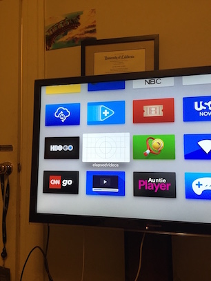

# elapsedvideos
POC of hosting videos on Amazon S3 to tvOS / Apple TV

This is a sample project of hosting files in Amazon S3 and streaming them to tvOS.

I have proven that you can upload your own videos to S3 and make it public, host your TVML content on an S3 bucket and make a simple tvOS application that can reference and read your collection of MP4 videos from Amazon S3.

Necessary:

xcode 7,
Apple TV 4,
S3 buckets

Copy the s3 files to an S3 bucket. Oneline.js is the file giving the layout of the videos you want to display in the TVML format.

In the other S3 bucket I have mp4 videos and the oneline.js references that video. In your xcode project, you reference the js file that is in S3.

While this is a simple example, in theory you can upload your whole movie collection to S3, every new file triggers an Amazon Lambda function to update your javascript file with references to the new S3 videos/images.

