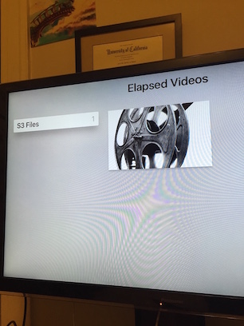

# elapsedvideos
POC of hosting videos on Amazon S3 to tvOS / Apple TV

This is a sample project of hosting files in Amazon S3 and streaming them to tvOS.

I have proven that you can upload your own videos to S3 and make it public, host your TVML content on an S3 bucket and make a simple tvOS application that can reference and read your collection of MP4 videos from Amazon S3.

Necessary:

xcode 7,
Apple TV 4
S3 buckets

